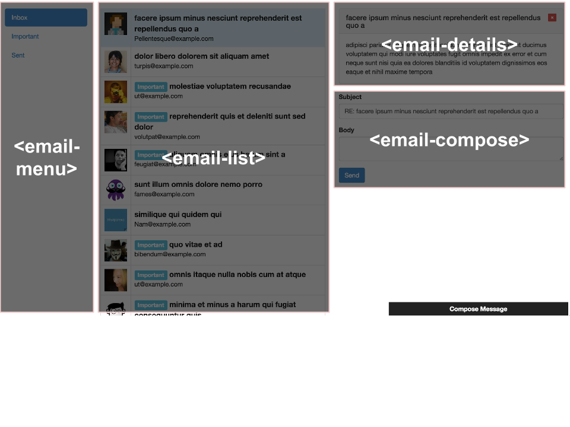
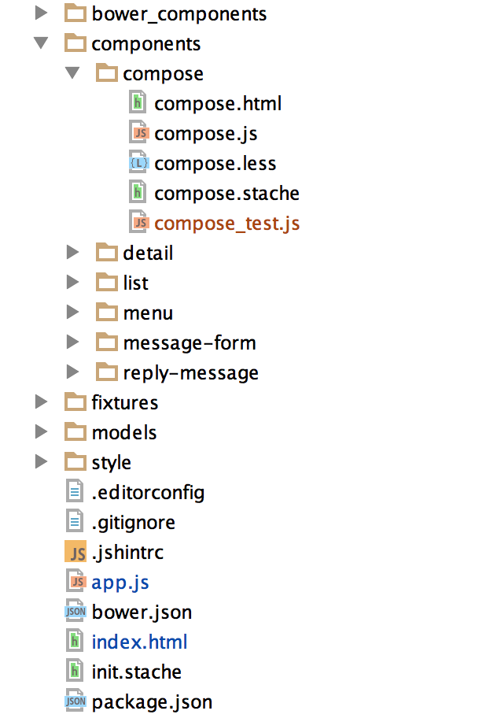
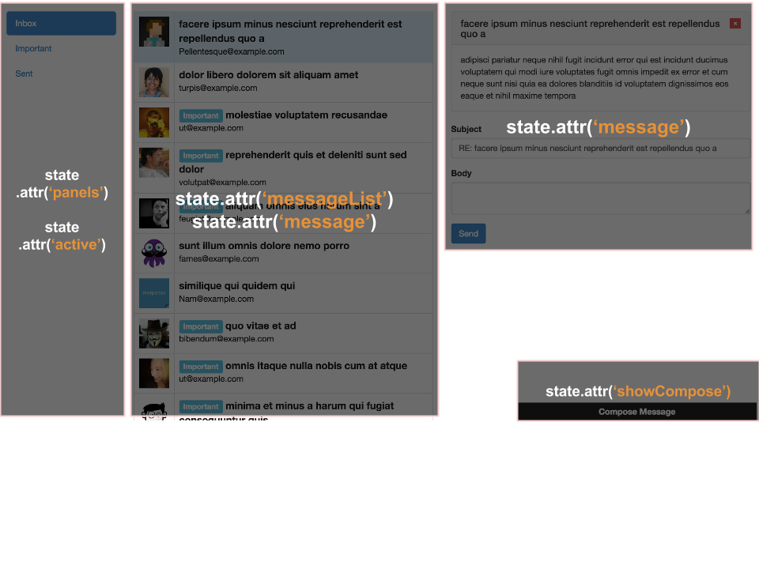

title: Application state and the define plugin
output: index.html
theme: theme
controls: false
logo: theme/logo.png

--

# Application state and the define plugin

--

# Application structure

> "The secret to building large apps is never build large apps. Break your applications into small pieces. Then, assemble those testable, bite-sized pieces into your big application"

<small><strong>Justin Meyer</strong> (Rockstar CanJS Ninja Guru, 2008)</small>


--



--

## Folder structure



--

## Web components

```javascript
<link rel="import" href="http://bitovi.com/email/compose.html">

<h1>Contact us</h1>

<email-compose id="compose"></email-compose>

<script>
	import Email from 'bitovi/email';

	var composer = document.getElementById('compose');

	composer.setEmail(new Email({
		to: 'info@mypage.com',
		subject: 'Contact information'
	}));
</script>
```

--

# Application state

--


--



--

## Main page

```javascript
<email-menu panels="{panels}" active="{list}"></email-menu>
<email-list list="{messageList}" message="{message}"></email-list>
{{#if message}}
<email-details message="{message}"></email-details>
{{/if}}
<email-compose show="{showCompose}"></email-compose>
```

--

## can.Map.define - An Overview

The can.Map.define plugin allows you to completely control the behavior of attributes on a can.Map like:

- The default value for a property
- A custom converter method or a pre-defined standard converter
- What value is returned when a property is read
- Behavior when a property is set
- How a property is serialized
- Behavior when a property is removed

It replaces the `can.Map.attributes` and `can.Map.setter` plugins.

--

## can.Map.define - `value`/`Value`

Defines the default value or default constructor function (`Value`) for a property

```javascript
var MyMap = can.Map.extend({
	define: {
		name: {
			value: 'David'
		},
		list: {
			Value: can.List
		}
	}
});

var instance = new MyMap();
instance.attr('name') // -> David
instance.attr('list').push('test');
```

--

## can.Map.define - `type`/`Type`

Defines a type converter when the property is set

```javascript
var MyList = can.List.extend({
	count: function() { return this.attr('length'); }
});
var MyMap = can.Map.extend({
	define: {
		isGuest: {
			type: 'boolean'
		},
		list: {
			Type: MyList
		}
	}
});
var instance = new MyMap({ isGuest: 'true', list: ['one', 'to'] });
instance.attr('isGuest') // -> true
instance.attr('list').count() // -> 2
```

--

## can.Map.define - `get`

Defines the value returned for this property

```javascript
var Person = can.Map.extend({
	define: {
		isDrinkingAge: {
			get: function() {
				return this.attr('age') >= 18;
			}
		}
	}
});

var person = new Person({ age: 20 });
person.attr('isDrinkingAge') // -> true
```

--

## can.Map.define - `set`

Defines functionality when the property is set (can also be asynchronous)

```javascript
var AppState = can.Map.extend({
	define: {
		message: {
			set: function(id, setValue) {
				Message.findOne({
					id: id
				}).then(setValue);
			}
		}
	}
});
```

--

## can.Map.define - `serialize`

Defines how a value is serialized

```javascript
var AppState = can.Map.extend({
	define: {
		message: {
			set: function(id, setValue) {
				Message.findOne({
					id: id
				}).then(setValue);
			},

			serialize: function() {
				return this.attr('message.id');
			}
		}
	}
});
```

--

## can.Map.define - `remove`

Is called when the attribute is removed

```javascript
var AppState = can.Map.extend({
	define: {
		message: {
			remove: function(current) {
				current.destroy();
			}
		}
	}
});
```

--

# Routing

> Serializes the current application state into a URL

```javascript
can.route.map(appState);

can.route(':list', {
	composeMessageOpen : false
});
can.route(':list/:messageId', {
	composeMessageOpen : false
});

can.route.ready();
```

-- presenter

# Brought to you by


__David Luecke__

* [<i class="fa fa-github"></i> daffl](https://github.com/daffl)
* [<i class="fa fa-twitter"></i> @daffl](http://twitter.com/daffl)
