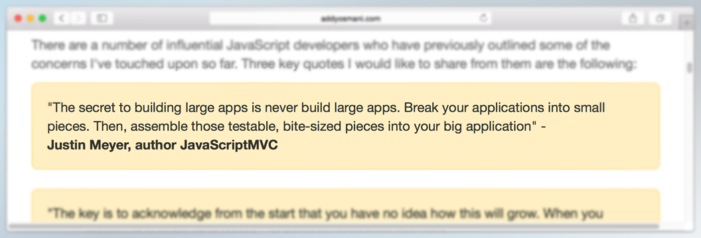
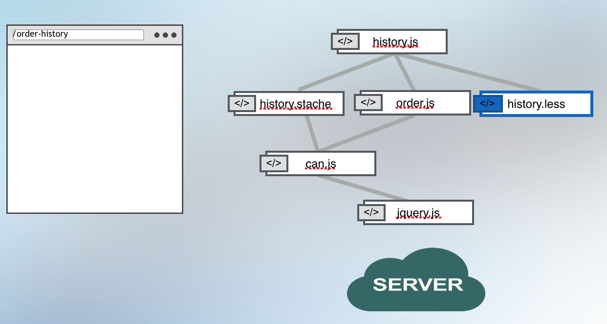
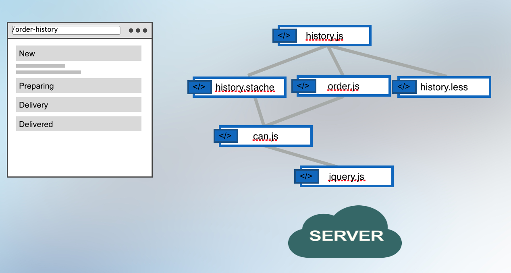
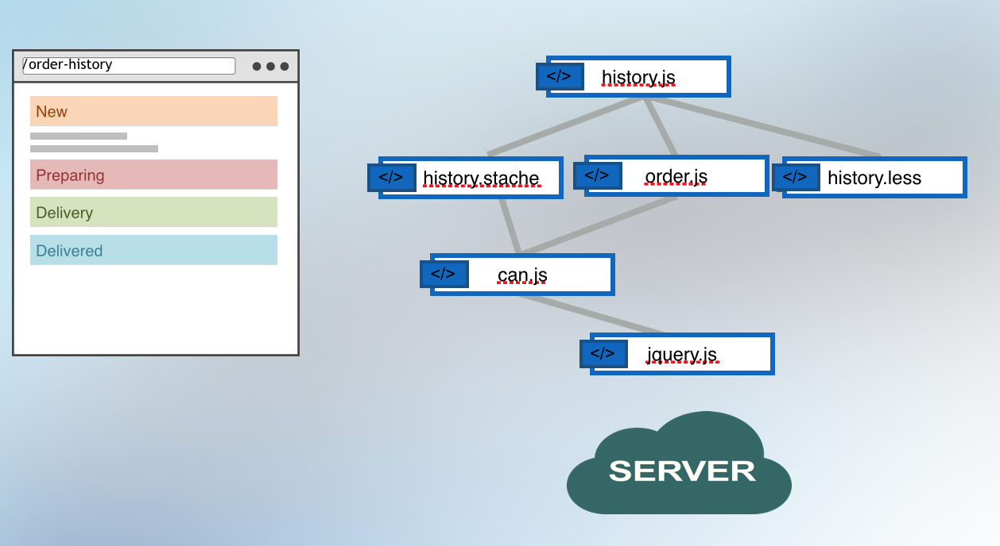
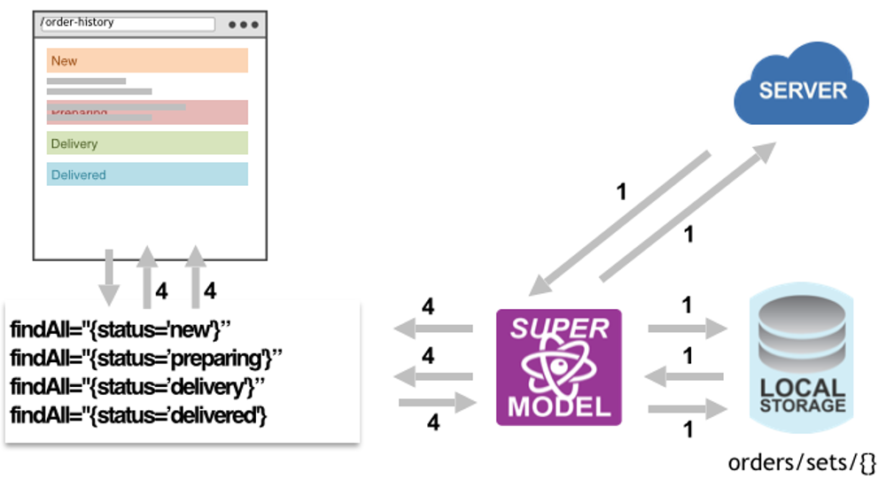

title: DoneJS - Get your app done
output: index.html
theme: theme
controls: false
logo: theme/logo.png
style: style.css

--

# DoneJS - Get your app done

-- presenter


## Matthew Phillips

* [<i class="fa fa-github"></i> matthewp](https://github.com/matthewp)
* [<i class="fa fa-twitter"></i> @matthewcp](http://twitter.com/matthewcp)

-- presenter


## David Luecke

* [<i class="fa fa-github"></i> daffl](https://github.com/daffl)
* [<i class="fa fa-twitter"></i> @daffl](http://twitter.com/daffl)

-- centered

## Some History: JavaScriptMVC


-- centered

## 2015


--

## Comes with...

- [StealJS](http://stealjs.com) - ES6, CJS, and AMD module loader and builder
- [CanJS](http://canjs.com) - Custom elements and Model-View-ViewModel utilities
- [jQuery](http://jquery.com) - DOM helpers
- [jQuery++](http://jquerypp.com) - Extended DOM helpers
- [QUnit](https://qunitjs.com/) or Mocha - Assertion library
- [FuncUnit](http://funcunit.com) - Functional tests
- Testee or Karma - Test runner
- [DocumentJS](http://documentjs.com) - Documentation
- [can-ssr](http://github.com/canjs/ssr) - Server-Side Rendering Utilities for CanJS
- [can-connect](https://github.com/canjs/can-connect) - Assemble real-time, high performance, restful data connections.

--

## Application features

- Universal (same code on server and client)
- Pushstate routing
- Real Time
- Run everywhere ( IE9+, Andriod, iOS, node-webkit )

--

## Performance features

- Progressive loaded optimized production builds
- Caching and minimal data requests
- Minimal DOM updates
- Application logic in worker thread

--

## Maintenance features

- Modlet workflow - tests, docs, and demo pages
- Use and create NPM packages
- Custom HTML elements
- MVVM single direction architecture
- Multi Versioned Documentation
- Live reload
- Functional tests

-- centered

## [place-my-order.com](http://place-my-order.com)


--

## Getting started

Create an application folder:

```
mkdir place-my-order
cd place-my-order
```

DoneJS uses a `package.json` for configuration and dependencies:

```
npm init
```

And is installed via NPM:

```
npm install donejs --save
```

Also install packages for place-my-order.com assets (CSS, Images) and API:

```
npm install place-my-order-assets place-my-order-api --save
```

--

## `pmo/index.stache`

```javascript
<html>
  <head>
    <title>Place My Order</title>
    {{asset "css"}}
  </head>
  <body>
    <can-import from="place-my-order-assets" />
    <can-import from="pmo/app" [.]="{value}" />
    <h1>{{message}}</h1>
    {{asset "inline-cache"}}

    {{#if isProduction}}
      <script src="/node_modules/steal/steal.production.js"
        main="pmo/index.stache!done-autorender"></script>
    {{else}}
      <script src="/node_modules/steal/steal.js"></script>
    {{/if}}
  </body>
</html>
```

--

## `pmo/app.js`

```javascript
// pmo/app.js
import AppMap from "can-ssr/app-map";

const AppState = AppMap.extend({
  message: 'Hello World!'
});

export default AppState;
```

In `package.json` add:

```javascript
"main": "pmo/index.stache!done-autorender",
"scripts": {
  "start": "can-serve --port 8080",
  "test": "echo \"Error: no test specified\" && exit 1"
},
"system": {
  "npmIgnore": ["documentjs", "place-my-order-api"]
}
```

--

# Server Side Rendering

Getting rid of the loading indicator.

--

## Benefits

* SEO
* Perceived Performance

--

## Implementation

### Single Context Virtual DOM

* Everything runs in a single Node.js context.
* Uses a very lightweight DOM.
* Everything is connected to the render lifecycle.

--

## Connected Lifecycle

```
curl http://place-my-order.com/restaurants/cow-barn/order
```

```javascript
<html>
<head>
  <link rel="stylesheet" href="/dist/bundles/pmo/index.css">
  <link rel="stylesheet" href="/dist/bundles/pmo/order/new/new.css">
</head>
<body>
  ...

  <script>
    INLINE_CACHE = {"restaurant":{"{..."}}}
  </script>
</body>
</html>
```

--

## `lib/app.js`

```javascript
var app = require("express")();
var url = require("url");

var render = require("can-ssr")({
  config: __dirname + "/package.json!npm"
});

app.get("/"), function(req, res){

  var pathname = url.parse(req.url).pathname;

  render(pathname).then(function(html){
    res.send(html);
  });

});

app.listen(7000);
```

--

### pmo/restaurant/list.js

```javascript
export const ViewModel = Map.extend({
  states: { get() { return State.findAll({}); } }, ...});

export default Component.extend({
  tag: 'app-restaurant-list',
  viewModel: ViewModel,
  template,
  events: {
    inserted(){
      let statesPromise = this.attr("states");
      this.scope.attr("@root").pageData( statesPromise );
    }
  }
});
```

--

## Server Side Rendering Techniques

| Technique         | Maintainability    | Speed  |
| ----------------- |:------------------:| ------:|
| Duplicate Code    | 0                  | 10     |
| Headless Browser  | 9                  | 5      |
| Virtual DOM       | 8                  | 8      |

--

## can-serve

* A simple web server with proxying and server side rendering built in.

```
can-serve --proxy http://localhost:7070 --port 8080
```

-- 

# Workflows

-- centered

# Modlet Workflow



-- centered

## Before


-- centered

## After


--

## Benefits

* Easier to identify missing tests or documentation.
* More likely to update tests and documentation.
* Good API design.
* Easier to develop in isolation.

--

# Components

--

###### hello.stache
```javascript
<h1>Hello {{name}}</h1>
```

###### hello-viewmodel.js
```javascript
import Map from "can/map/";

export default Map.extend({
  name: ""
});
```

###### hello.js

```javascript
import Component from "can/component/";
import ViewModel from "./hello-viewmodel";
import template from "./hello.stache!";

Component.extend({
  tag: "hello-greeting",
  viewModel: ViewModel,
  template
});
```

--

### Output

```javascript
<hello-greeting name="world">

  <h1>Hello world!</h1>

</hello-greeting>
```

--

## Benefits

* Declaratively write your application.
* Separation between View Model and View logic.

## Warts

* Boilerplate.

--

## done-component

A StealJS plugin that allows composing CanJS Components in a single file:

### hello.component

```javascript
<can-component tag="hello-greeting">
  <template>
    <h1>Hello {{name}}!</h1>
  </template>
  <view-model>
    import Map from "can/map/";

    export default Map.extend({
      name: ""
    });
  </view-model>
</can-component>
```

--

## Composition

```javascript
import { ViewModel, template } from "hello-world.component!";

const vm = new ViewModel();

console.log(template(vm));
```

--

## `pmo/home.component`

```javascript
<can-component tag="pmo-home">
  <template>
    <div class="homepage">
      
      <h1>Ordering food has never been easier</h1>
      <p>
        We make it easier than ever to order gourmet food
        from your favorite local restaurants.
      </p>
      <p><a class="btn" href="/restaurants" role="button">
        Choose a Restaurant
      </a></p>
    </div>
  </template>
</can-component>
```

--

# Live Reload
## aka Hot Module Swapping

--

* Watch your app react to changes you make to modules as you edit the code.
* The window never reloads, only the modules you change.

--

## Benefits

* 0.1 second – users feel like their actions are directly causing something to happen on the screen.
* 1 second - users notice the short delay, but they stay focused on their current train of thought.

-- centered



-- centered



-- centered



--

# Using other projects

--

# Routing

--

## Two way routing

Update `pmo/app.js` to:

```javascript
// pmo/app.js
import AppMap from "can-ssr/app-map";
import route from 'can/route/';

const AppState = AppMap.extend({});

export default AppState;

route(':page', { page: 'home' });
route(':page/:slug', { slug: null });
route(':page/:slug/:action', { slug: null, action: null });

export default AppState;
```

--

## Routes vs. application state

```javascript
route.deparam('/home')
// -> { page: 'home' }
route.deparam('/restaurants/cheese-city/order')
// -> { page: 'restaurants', slug: 'cheese-city', action: 'order' }

state.attr({ page: 'order-history' })
// -> /order-history
state.attr({ page: 'restaurants', slug: 'cheese-city' })
// -> /restaurants/cheese-city
route.attr({
	page: 'restaurants',
	state: 'IL',
	city: 'Chicago'
})
// -> /restaurants?state=IL&city=Chicago
```

--

## Routing in templates

```javascript
{{#eq page "home"}}
  <pmo-home></pmo-home>
{{/eq}}
{{#eq page "restaurants"}}
  <can-import from="pmo/restaurant/list/" can-tag="pmo-loading">
    <pmo-restaurant-list></pmo-restaurant-list>
  </can-import>
{{/eq}}
```

--

## Nested routes

```javascript
route(':page/:slug', { slug: null });
route(':page/:slug/:action', { slug: null, action: null });
```

```javascript
{{#eq page "home"}}
  <pmo-home></pmo-home>
{{/eq}}
{{#eq page "restaurants"}}
  {{#if slug}}
    {{#eq action 'order'}}
      <pmo-order-new slug="{slug}"></pmo-order-new>
    {{/eq}}

    {{^if action}}
      <pmo-restaurant-details></pmo-restaurant-details>
    {{/if}}
  {{else}}
    <pmo-restaurant-list></pmo-restaurant-list>
  {{/if}}
{{/eq}}
```

--

## `can-href`

```javascript
<div class="restaurant">
  
  <h3>{{name}}</h3>
  <a class="btn" can-href="{ page='restaurants' slug=slug }">Details</a>
</div>
```

`href` will be `/restaurants/<restaurant-slug>`.

Change the route

```javascript
route(':page/restaurant/:slug');
```

`href` will become `/restaurants/restaurants/<restaurant-slug>`.

--

## Benefits

- Keep routing rules separate from application logic.
- Update routing rules independent of the page.
- Makes you think about describing application state first

--

# Super Models

--

## can-connect

Middleware for persisting data that can:

- Retrieve, parse and extract data
- Keep lists live
- Perform real-time updates
- Cache (fall-through, inline-cache, localstorage, in-memory)
- Combine multiple requests
- `can.Model` compatibility layer

--

## Load data in Stache templates

```javascript
<can-import from="pmo/models/restaurant" />
<restaurant-model get-list="{ state=state city=city }">
  {{#if isPending}}
    <div class="loading"></div>
  {{else}}
    {{#if isResolved}}
      <ul>
      {{#each value}}
        <li>{{name}}</li>
      {{/each}}
      </ul>
    {{else}}
      <div class="error">An error occurred</div>
    {{/if}}
  {{/if}}
</restaurant-model>
```

-- centered

## Inline cache


-- centered

## Combined request and fall-through cache



--

# Testing

--

## A simple QUnit test

`pmo/test.js`:

```javascript
import QUnit from 'steal-qunit';

QUnit.module('Basic tests');

QUnit.test('basics', function(){
  ok(true, 'Test ran');
});
```

`pmo/test.html`:

```javascript
<title>pmo/test</title>
<script src="../node_modules/steal/steal.js" main="pmo/test"></script>
<div id="qunit-fixture"></div>
```

--

## Automating tests

Install a command line test runner:

```
npm install testee --save-dev
```

Update the `npm test` script:

```javascript
"scripts": {
    "test": "testee pmo/test.html --browsers firefox",
```

Run the tests:

```
npm test
```

--

## Testing components

```javascript
<can-component tag="pmo-counter">
  <template>
    Button clicked <span class="count">{{count}}</span> times
    <button class="btn" can-click="{increment}">Update count</button>
  </template>
  <view-model>
    import Map from 'can/map/';
    import 'can/map/define/';

    export default Map.extend({
      define: { count: { value: 0 } },
      increment() {
        this.attr('count', this.attr('count') + 1);
      }
    });
  </view-model>
</can-component>
```

--

## Functional unit-tests


```javascript
import QUnit from 'steal-qunit';
import F from 'funcunit';
import Home from './counter.component!';
import stache from 'can/view/stache/';
import $ from 'jquery';

F.attach(QUnit);

const template = stache(`<pmo-counter></pmo-counter>`);

QUnit.module('pmo/counter');

QUnit.test('Increments count', function(){
  $('#qunit-fixture').html(template({}));
  F('pmo-counter .count').html('0', 'Count 0 intially');
  F('pmo-counter button').click();
  F('pmo-counter .count').html('1', 'Count incremented');
});
```

--

# Production Workflows

--

## Build for any Environment

* The Web
* iOS and Android (Cordova)
* Desktop (NW.js)

--

## Steal Tools

* Creates optimized bundles for:
  * Progressively loaded single page applications.
  * Multiple apps with shared dependencies.

--

### steal-cordova and steal-nw

```javascript
var stealTools = require("steal-tools");

var stealCordova = require("steal-cordova")({
  platforms: ["ios", "android"]
});

var buildPromise = stealTools.build({
  config: __dirname + "/package.json!npm"
});

buildPromise.then(stealCordova.build);
```
