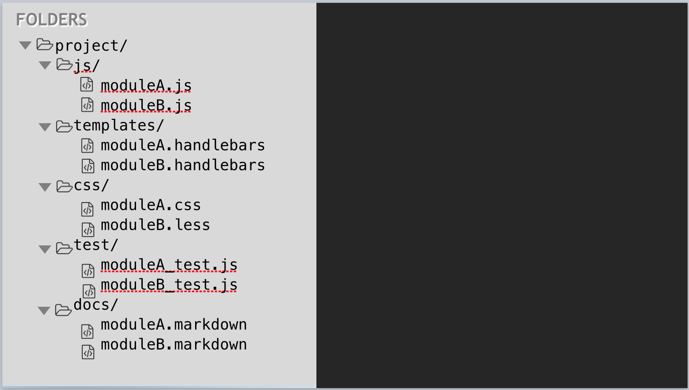

title: DoneJS - Your app. Done.
output: index.html
theme: theme
controls: false
logo: theme/logo.png
style: style.css

-- title-page

<h1>
    
    <p>Your app. Done.</p>
</h1>

-- centered

## What are we trying to do?


#### Build maintainable, high performance, real time, web and mobile applications.

-- centered

## History: JavaScriptMVC


-- centered

## 2015


--

## Comes with...

- [StealJS](http://stealjs.com) - ES6, CJS, and AMD module loader and builder
- [CanJS](http://canjs.com) - Custom elements and Model-View-ViewModel utilities
- [jQuery](http://jquery.com) - DOM helpers
- [jQuery++](http://jquerypp.com) - Extended DOM helpers
- [QUnit](https://qunitjs.com/) or Mocha - Assertion library
- [FuncUnit](http://funcunit.com) - Functional tests
- [Testee](https://github.com/bitovi/testee) - Test runner
- [DocumentJS](http://documentjs.com) - Documentation
- [can-ssr](http://github.com/canjs/ssr) - Server-Side Rendering Utilities for CanJS
- [can-connect](https://github.com/canjs/can-connect) - Assemble real-time, high performance, restful data connections.

--

## Application features

- Universal (same code on server and client)
- Pushstate routing
- Real Time
- Run everywhere ( IE9+, Andriod, iOS, node-webkit )

--

## Performance features

- Progressive loaded optimized production builds
- Caching and minimal data requests
- Minimal DOM updates
- Application logic in worker thread

--

## Maintenance features

- Modlet workflow - tests, docs, and demo pages
- Use and create NPM packages
- Custom HTML elements
- MVVM single direction architecture
- Multi Versioned Documentation
- Live reload
- Functional tests

-- title-page

# From scratch...

--

## NPM + StealJS

Create a new NPM package and install dependencies:

```
mkdir place-my-order
cd place-my-order
npm init
npm install steal can --save
```

Create `index.html`:

```javascript
<!DOCTYPE html>
<html>
  <head>
    <title>Place My Order</title>
  </head>
  <body>
    <script src="node_modules/steal/steal.js"></script>
  </body>
</html>
```

--

## app.js and main template

Add `app.js`:

```javascript
import $ from 'jquery';
import Map from 'can/map/';
import template from './index.stache!';

let state = new Map({
    message: 'Hello world'
});

$('body').append(template(state));
```

And the template in `index.stache`:

```javascript
<h1>{{message}}</h1>
```

-- title-page

# Creating a DoneJS application

--

## The DoneJS CLI

A command line utility that is used to execute generators and other scripts *installed locally in your project*:

```
npm install donejs -g
```

- `donejs init [appname]` initializes a new application in the current or `appname` folder.
- `donejs generate` runs generators from [generator-donejs](https://github.com/donejs/generator-donejs)
- `donejs <script>` runs scripts declared in your `package.json`
- if no script is found it will try to run the local `donejs-` prefixed binary (`node_modules/.bin/donejs-<script>`)

__Example: Development mode__

```
donejs develop
```

--

## generator-donejs

A [Yeoman](http://yeoman.io/) generator for the application, components and models.

```javascript
var generators = require('yeoman-generator');
var path = require('path');

module.exports = generators.Base.extend({
  prompting() {
		this.prompt({
			name: 'name', type: String, required: true,
			message: 'The name for you model (e.g. order)'
		}, prompts => {
		    this.name = prompts.name;
		    done();
		});
  },

  writing() {
    this.fs.copyTpl(this.templatePath('mymodel.js'),
      this.destinationPath(path.join('models', 'mymodel.js')),
      { data }
    );
  }
});
```

-- centered

## Assets and API


## +


-- title-page

<h1>Custom elements <br><small>aka &lt;components /&gt;</small></h1>

-- centered

## Modlet workflows


-- centered

## Not Modlets



-- centered

## Modlets!


--

## done-component

--

## Modlet components

-- title-page

# Routing

--

## CanJS 2.3

- [can-href](http://canjs.com/2.3-pre/docs/can.view.href.html)
- [&lt;can-import /&gt;](http://canjs.com/2.3-pre/docs/can%7Cview%7Cstache%7Csystem.import.html)
- Stache sub-expressions (`{{#helper1 (helper2 prop test) 'arg'}}`)
- Base URL helper [{{~}}](http://canjs.com/2.3-pre/docs/can.stache.helpers.tilde.html)
- `switch` statements
    - [{{#switch}}](http://canjs.com/2.3-pre/docs/can.stache.helpers.switch.html)
    - [{{#case}}](http://canjs.com/2.3-pre/docs/can.stache.helpers.case.html)
    - [{{#default}}](http://canjs.com/2.3-pre/docs/can.stache.helpers.default.html)

--

## Routes vs. application state

```javascript
route.deparam('/home')
// -> { page: 'home' }
route.deparam('/restaurants/cheese-city/order')
// -> { page: 'restaurants', slug: 'cheese-city', action: 'order' }

state.attr({ page: 'order-history' })
// -> /order-history
state.attr({ page: 'restaurants', slug: 'cheese-city' })
// -> /restaurants/cheese-city
route.attr({
	page: 'restaurants',
	state: 'IL',
	city: 'Chicago'
})
// -> /restaurants?state=IL&city=Chicago
```

-- title-page

# Creating a view-model

--

## View model state

```javascript
{
    states: Promise<[State]>
    state: String "IL”,
    cities: Promise<[City]>,
    city: String "Chicago”,
    restaurants: Promise<[Restaurant]>
}
```

--

## fixtures

-- title-page

# Component communication

--

## Child to parent

### Children get parent view model

```
<parent #parent>
	<child parent="{parent}"/>
</parent>
```
leakScope?

### Child view model to parent

```
<parent>
	<child (saved)="{parentMethod}"/>
</parent>

viewModel: {
	saveItem: function(item){
		item.save().then(()=>{
		  this.dispatch("saved",[item])
		})
	}
},
events: {
	inserted: function(){
		this.viewModel.attr("element", this.element)
	},
	"{scope} saved": function(viewModel, ev, item){
		this.element.trigger("saved",[viewModel].concat(arguments.slice(2)));
	}
}
```

 - testing .. you need an element

--

## Parent to child

### view scope

```
<editor toolbar="{toolbar}">
	<toolbar #toolbar="{.}">
	<rich-text #rich-text="{.}">
</editor>

Editor{
	viewModel: {
		refresh: function(){
			this.attr("toolbar").refresh();
			this.attr("richText").refresh()
		}
	}
}
```

### add to parent view model method (bit-tabs)

```
events: {
	inserted: function(){

	}
}
```

--

## Sibling to sibling

instantiate_4

--

## Broadcast?

anti-pattern
```
.attr("@root").dispatch("error")

"{@root} error"
```

--

# Testing and CI

--

# Nested routes

--

# Documentation

--

# Deployment
