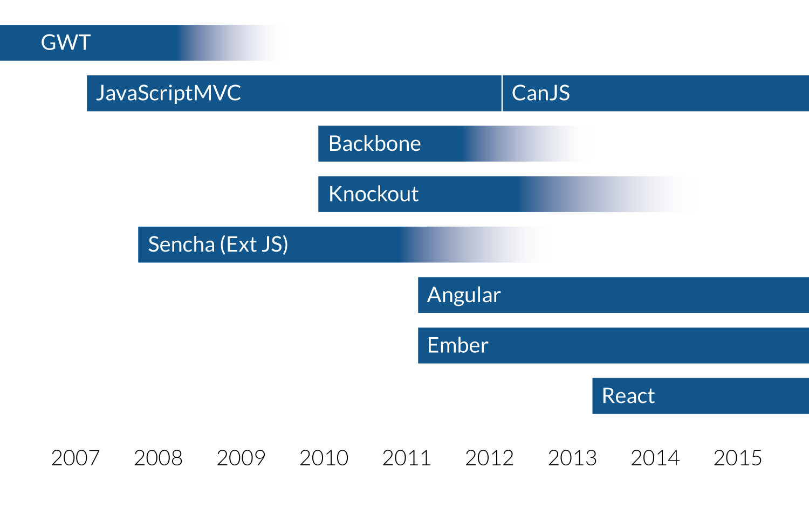
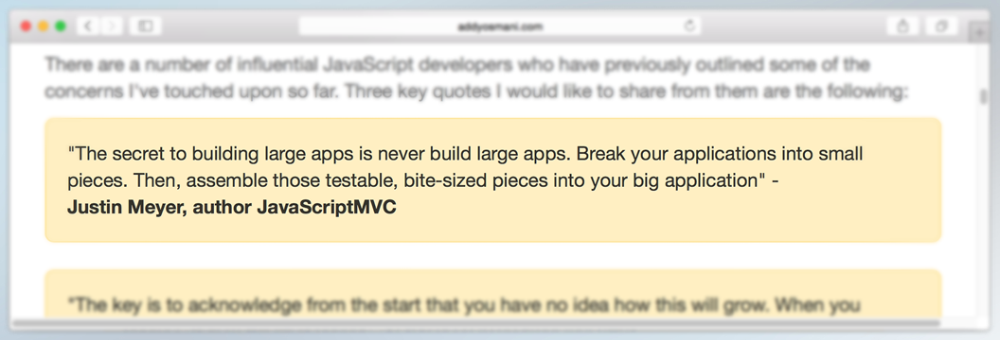
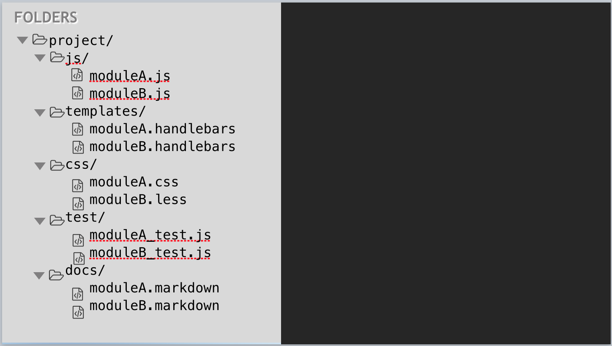
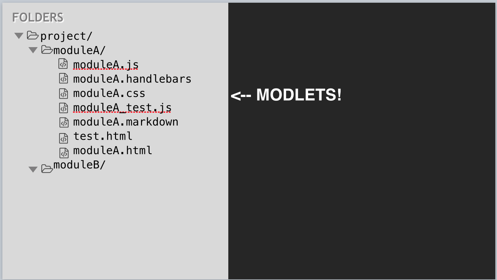
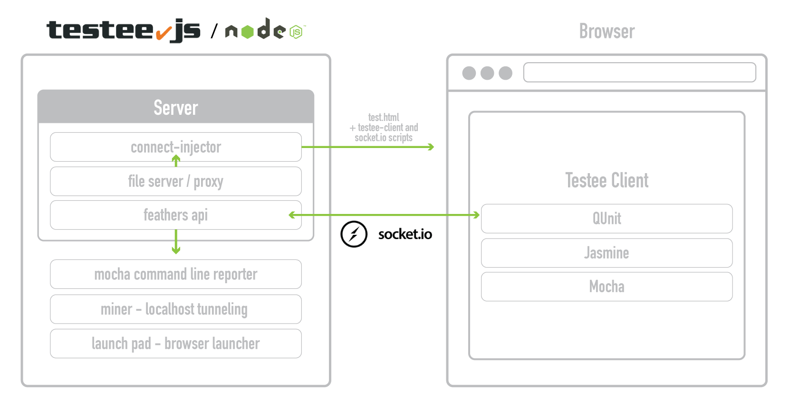

title: DoneJS - Your app. Done.
output: index.html
theme: theme
controls: false
logo: theme/logo.png
style: style.css

-- title-page

<h1>
    
    <p>Your app. Done.</p>
</h1>

-- centered

## What are we trying to do?


#### Build maintainable, high performance, real time, web and mobile applications.

-- centered

## History: JavaScriptMVC



-- centered

## 2015


--

## Comes with...

- [StealJS](http://stealjs.com) - ES6, CJS, and AMD module loader and builder
- [CanJS](http://canjs.com) - Custom elements and Model-View-ViewModel utilities
- [jQuery](http://jquery.com) - DOM helpers
- [jQuery++](http://jquerypp.com) - Extended DOM helpers
- [QUnit](https://qunitjs.com/) or Mocha - Assertion library
- [FuncUnit](http://funcunit.com) - Functional tests
- [Testee](https://github.com/bitovi/testee) - Test runner
- [DocumentJS](http://documentjs.com) - Documentation
- [can-ssr](http://github.com/canjs/ssr) - Server-Side Rendering Utilities for CanJS
- [can-connect](https://github.com/canjs/can-connect) - Assemble real-time, high performance, restful data connections.

--

## Application features

- Universal (same code on server and client)
- Pushstate routing
- Real Time
- Run everywhere ( IE9+, Andriod, iOS, node-webkit )

--

## Performance features

- Progressive loaded optimized production builds
- Caching and minimal data requests
- Minimal DOM updates
- Application logic in worker thread

--

## Maintenance features

- Modlet workflow - tests, docs, and demo pages
- Use and create NPM packages
- Custom HTML elements
- MVVM single direction architecture
- Multi Versioned Documentation
- Live reload
- Functional tests

-- title-page

# From scratch...

--

## NPM + StealJS

Create a new NPM package and install dependencies:

```
mkdir place-my-order
cd place-my-order
npm init
npm install steal can --save
```

Create `index.html`:

```javascript
<!DOCTYPE html>
<html>
  <head>
    <title>Place My Order</title>
  </head>
  <body>
    <script src="node_modules/steal/steal.js"></script>
  </body>
</html>
```

--

## app.js and main template

Add `app.js`:

```javascript
import $ from 'jquery';
import Map from 'can/map/';
import template from './index.stache!';

let state = new Map({
    message: 'Hello world'
});

$('body').append(template(state));
```

And the template in `index.stache`:

```javascript
<h1>{{message}}</h1>
```

-- title-page

# Creating a DoneJS application

--

## The DoneJS CLI

A command line utility that is used to execute generators and other scripts *installed locally in your project*:

```
npm install donejs -g
```

- `donejs init [appname]` initializes a new application in the current or `appname` folder.
- `donejs generate` runs generators from [generator-donejs](https://github.com/donejs/generator-donejs)
- `donejs <script>` runs scripts declared in your `package.json`
- if no script is found it will try to run the local `donejs-` prefixed binary (`node_modules/.bin/donejs-<script>`)

__Example: Development mode__

```
donejs develop
```

--

## generator-donejs

A [Yeoman](http://yeoman.io/) generator for the application, components and models.

```javascript
var generators = require('yeoman-generator');
var path = require('path');

module.exports = generators.Base.extend({
    prompting() {
		this.prompt({
			name: 'name', type: String, required: true,
			message: 'The name for you model (e.g. order)'
		}, prompts => {
		    this.name = prompts.name;
		    done();
		});
    },

    writing() {
            this.fs.copyTpl(this.templatePath('mymodel.js'),
            this.destinationPath(path.join('models', 'mymodel.js')),
            { data }
        );
    }
});
```

--

## Project structure

- `package.json` - main configuration
- `test.html` - global test page
- `documentjs.json` - Documentation
- `src` - development asset folder
- `src/app.js` - main application file
- `src/index.stache` - main template
- `src/models/` - models and fixtures
- `src/styles.less` - main application LESS
- `src/test/test.js` - loads all tests that run in `test.html`
- `src/test/smoke.js` - functional application smoke test

-- centered

## Assets and API


## +


-- title-page

<h1>Custom elements <br><small>aka &lt;components /&gt;</small></h1>

-- centered

## Modlet workflows




-- centered

## Not Modlets



-- centered

## Modlets!



--

## Benefits

* Easier to identify missing tests or documentation.
* More likely to update tests and documentation.
* Good API design.
* Easier to develop in isolation.

--

## done-component

A StealJS plugin that allows composing CanJS Components in a single file:

```javascript
<can-component tag="hello-greeting">
  <template>
    <h1>Hello {{name}}!</h1>
  </template>
  <view-model>
    import Map from "can/map/";

    export default Map.extend({ name: "" });
  </view-model>
</can-component>
```

```javascript
import { ViewModel, template } from "hello-world.component!";

const vm = new ViewModel();

console.log(template(vm));
```

--

## Modlet components

-- title-page

# Routing

--

## Routes vs. application state

```javascript
route.deparam('/home')
// -> { page: 'home' }
route.deparam('/restaurants/cheese-city/order')
// -> { page: 'restaurants', slug: 'cheese-city', action: 'order' }

state.attr({ page: 'order-history' })
// -> /order-history
state.attr({ page: 'restaurants', slug: 'cheese-city' })
// -> /restaurants/cheese-city
route.attr({
	page: 'restaurants',
	state: 'IL',
	city: 'Chicago'
})
// -> /restaurants?state=IL&city=Chicago
```

--

## CanJS 2.3

- [can-href](http://canjs.com/2.3-pre/docs/can.view.href.html)
- [(event)](http://canjs.com/2.3-pre/docs/can.view.bindings.can-EVENT.html) notation
- [#property](http://canjs.com/2.3-pre/docs/can.view.bindings.reference.html) scope reference importing
- [&lt;can-import /&gt;](http://canjs.com/2.3-pre/docs/can%7Cview%7Cstache%7Csystem.import.html)
- Stache sub-expressions (`{{#helper1 (helper2 prop test) 'arg'}}`)
- Base URL helper [{{~}}](http://canjs.com/2.3-pre/docs/can.stache.helpers.tilde.html)
- `switch` statements
    - [{{#switch}}](http://canjs.com/2.3-pre/docs/can.stache.helpers.switch.html)
    - [{{#case}}](http://canjs.com/2.3-pre/docs/can.stache.helpers.case.html)
    - [{{#default}}](http://canjs.com/2.3-pre/docs/can.stache.helpers.default.html)

--

## Routing in templates

```javascript
{{#switch page}}
    {{#case 'home'}}
        <pmo-home></pmo-home>
    {{/case}}
    {{#case 'restaurants'}}
        <can-import from="pmo/restaurant/list/" can-tag="pmo-loading">
            <pmo-restaurant-list></pmo-restaurant-list>
        </can-import>
    {{/case}}
{{/switch}}
```

-- title-page

# Component communication

--

## Child knows about parent

#### Children get parent view model

```javascript
<parent-component>
	<child-component parent="{.}"/>
</parent-component>
```

[JSBin](http://jsbin.com/sefame/edit?js,output)

--

## Child knows about parent #2

#### Register on inserted

```javascript
events: {
    inserted: function() {
        var parent = this.element.parent().viewModel();
        this.viewModel.attr('parent', parent);
    }
}
```

[JSBin](http://jsbin.com/wabahi/edit?js,output)

--

## Parent knows about children

#### Importing a reference

```javascript
<app-editor toolbar="{toolbar}" rich-text="{rich-text}">
	<app-toolbar #toolbar="{.}">
	<app-rich-text #rich-text="{.}">
</app-editor>
```


```javascript
{
	viewModel: {
		refresh: function(){
			this.attr("toolbar").refresh();
			this.attr("richText").refresh()
		}
	}
}
```

--

## Sibling to sibling

```javascript
<app-editor #editor="{.}" />
<app-toolbar editor="{editor}" />
```

```javascript
viewModel: {
    refresh: function() {
        this.attr('editor').refresh();
    }
}
```

[JSBin](http://jsbin.com/diwiju/edit?js,output)

--

## Broadcast

Access `@root` view model.

```javascript
viewModel: {
    refresh: function() {
        this.attr('@root.error', 'This is a global error');
    }
}
```

*Avoid if possible*

[JSBin](http://jsbin.com/tizeqa/edit?html,js,output
)

--

## Sending events to parents

```javascript
<parent-component (saved)="{parentMethod}">
	<child-component />
</parent-component>
```

child-component:

```javascript
viewModel: {
    saveItem: function(item) {
        can.dispatch.call(this, "saved", [item]);
    }
},
events: {
    "{viewModel} saved": function(viewModel, ev, item) {
        this.element.trigger("saved", item);
    }
}
```

[JSBin](http://jsbin.com/biroxe/edit?js,output)

--

## Sending events to children

#### [jQuery++](http://jquerypp.com/) event reverse

```javascript
$.event.reverse('refresh');

viewModel: {
  refresh: function(item) {
    can.dispatch.call(this, "refresh", [item]);
  }
},
events: {
  "{viewModel} refresh": function(viewModel, ev, item) {
    this.element.trigger("refresh", item);
  }
}
```

-- title-page centered

# Supermodels!

## [can-connect](http://connect.canjs.com/)

Model layer utilities for every JavaScript framework! Assemble real-time, high performance, restful data connections.

-- title-page

# Creating a view-model

--

## View model state

```javascript
{
    states: Promise<[State]>
    state: String "IL”,
    cities: Promise<[City]>,
    city: String "Chicago”,
    restaurants: Promise<[Restaurant]>
}
```

--

## fixtures

`fixtures.store` creates a complete REST mock service:

```javascript
import fixture from 'can-connect/fixture/';

const store = fixture.store([ data ]);

fixture({
  'GET /orders': store.findAll,
  'GET /orders/{id}': store.findOne,
  'POST /orders': store.create,
  'PUT /orders/{id}': store.update,
  'DELETE /order/{id}': store.destroy
});

export default store;
```

--

## Unit tests

```javascript
import QUnit from 'steal-qunit';
import cityStore from 'place-my-order/models/fixtures/city';
import stateStore from 'place-my-order/models/fixtures/state';
import restaurantStore from 'place-my-order/models/fixtures/restaurant';
import { ViewModel } from './list';

QUnit.module('place-my-order/restaurant/list', {
  beforeEach() {
    localStorage.clear();
  }
});
```

-- title-page

# Nested routes

--

## In-template nested routes

```javascript
route(':page', { page: null });
route(':page/:slug', { slug: null });
route(':page/:slug/:action', { slug: null, action: null });
```

```javascript
{{#case "restaurants"}}
  {{#if slug}}
    {{#switch action}}
        {{#case 'order'}}...{{/case}}
        {{#default}}...{{/default}}
    {{/switch}}
  {{else}}
    <pmo-restaurant-list></pmo-restaurant-list>
  {{/if}}
{{/case}}
```

-- title-page

# Importing other projects

--

## [bit-tabs](https://github.com/bitovi-components/bit-tabs)

```javascript
<can-import from="bit-tabs"/>

<bit-tabs>
    <bit-panel title="CanJS">
      CanJS provides the MV*
    </bit-panel>
    <bit-panel title="StealJS">
      StealJS provides the infrastructure.
    </bit-panel>
</bit-tabs>
```

-- title-page

# Testing and CI

--

## Popular CI servers

- Open source:
	- [Jenkins](http://jenkins-ci.org/): Probably most popular CI server, formerly Hudson
	- [CruiseControl](http://cruisecontrol.sourceforge.net/): CI framework initially by Thoughtworks
	- [TravisCI](http://travis-ci.org): Distributed build platform for the open source community (paid)
- Paid:
    - [Codeship](https://codeship.com/)
    - [CircleCI](https://circleci.com/)
    - [Appveyor](http://www.appveyor.com/) (Windows)

-- centered

## [Testee](https://github.com/bitovi/testee) - Automated cross-browser testing



--

## [FuncUnit](http://funcunit.com/)

Enable frame-mode (to avoid browser popup and PhantomJS errors):

```javascript
<script>FuncUnit = { frameMode: true };</script>
```

```javascript
import F from 'funcunit';
import QUnit from 'steal-qunit';

F.attach(QUnit);

QUnit.module('place-my-order functional smoke test', {
  beforeEach() {
    F.open('/');
  }
});

QUnit.test('place-my-order main page shows up', function() {
  F('title').text('place-my-order', 'Title is set');
});
```

-- title-page

# Documentation

-- title-page

# Deployment
